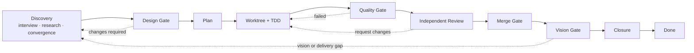

# Group Feature Lifecycle

ChainTogether treats a feature as a durable project object, not as one agent
turn. A `FeatureRun` survives group messages, agent handoffs, worktrees,
reviews, merges, and final acceptance. Its canonical human-readable record is
`docs/features/FNNN-kebab-case/feature.md`.

This lifecycle is group-first. A group invocation owns the ball for one routed
message; the linked FeatureRun owns product progress across all invocations.

## Sources of truth

| Concern | Canonical source | Derived/runtime form |
|---|---|---|
| Feature intent, ACs, decisions, verdicts | `docs/features/FNNN-*/feature.md` | `docs/features/index.{md,json}` |
| State machine and gates | `.chaintogether/workflows/feature-lifecycle.yaml` | `feature_runs` and `feature_run_events` |
| Skill content | `.chaintogether/skills/<name>/` | `.claude/skills/` and `.codex/skills/` |
| Skill inventory and provider mounts | `.chaintogether/skills.yaml` | sync report |
| One group-message custody chain | `group_invocations` | in-memory `GroupRunState` |
| Feature ↔ invocation relation | `feature_invocation_links` | `feature_run_id` in API responses |
| Group's current Feature | `group_active_features` | D14 `update-workflow-sop` block on every routed turn |

Do not edit `.claude/skills/` or `.codex/skills/` directly. They are generated
provider views. Claude Code and Codex therefore consume the same skill text,
while provider-only metadata such as `agents/openai.yaml` remains colocated
with the canonical skill package.

## Lifecycle



The Discovery Loop makes the problem explicit before code:

1. `feature-discovery` interviews the operator, captures the verbatim signal,
   defines the scope unit and user journey, and turns ambiguity into questions.
2. Research records evidence and alternatives instead of filling gaps by
   intuition.
3. Discussion convergence records decisions and rejected alternatives. The
   disagreement trail is part of the artifact, not disposable chat.

The Delivery Loop turns the approved Feature Doc into accepted behavior:

1. `design-gate` checks ownership, boundaries, extension points, risks, and
   testability. The `Design Gate` section must say `Verdict: approved` before
   planning.
2. `writing-plans` decomposes work by AC and identifies verification commands.
3. `worktree` isolates the change; `tdd` drives observable behavior from a
   failing test to the smallest implementation.
4. `quality-gate` supplies test/lint/build evidence. “AC green” is necessary,
   but independent review is still pending.
5. `request-review` creates a review packet; `review-feature` produces an
   independent verdict; `receive-review` resolves findings with evidence.
6. `merge-gate` verifies the reviewed revision is still the revision being
   merged and records merge/CI evidence.
7. `vision-gate` replays the promised user journey against the merged result.
   The guardian must be independent from owner and reviewer.
8. `close-feature` reconciles the Feature Doc, events, ACs, evidence, and final
   state. Only then may the feature become `done`.

Rollback edges are part of the workflow. A failed gate moves to a named earlier
stage with a reason; it never silently edits history to look linear.

## Group operation

1. Create a FeatureRun with `POST /api/groups/{group_id}/features`. This creates
   the next canonical `FNNN` dossier and makes it the group's current Feature.
2. Assign distinct `owner_agent_id`, `reviewer_agent_id`, and
   `vision_guardian_agent_id` with `PATCH /api/features/{run_id}/roles`.
3. Read or change the current Feature with
   `GET/PUT /api/groups/{group_id}/active-feature`. Supplying `feature_run_id`
   on a group send also switches it explicitly; otherwise later sends inherit
   the persisted current Feature.
4. On every routed Agent turn, the controller reloads current FeatureRun state
   and renders the registered D14 `update-workflow-sop` dynamic template. D14
   names FeatureRun/Feature, stage/state, receiving role, canonical doc, gate,
   role-aware suggested skill, and the stage's concrete next step.
5. Record evidence in the repository, then request a transition through
   `POST /api/sessions/{session_id}/features/{run_id}/transition`. The control
   plane requires the live session's unlisted
   `X-Octopus-Session-Capability`. The value is placed in the parent Harness
   process environment—not provider CLI arguments—and inherited by that
   Agent's MCP subprocess. The control plane derives the actor from the bound
   group-agent session instead of
   accepting a caller-selected identity. It validates the edge, optimistic
   revision, role separation, existing evidence paths, exact Git revision, and
   structured canonical-document provenance.
6. Audit the immutable trail with `GET /api/features/{run_id}/events`.

An invocation may pass among several group agents without changing the feature
stage. Conversely, one feature stage may span many invocations. Agents report
evidence; only the control plane records the transition. Each accepted
transition uses compare-and-swap against the observed stage and `updated_at`,
appends its event, and queues the matching Feature Doc update in one database
transaction. A durable outbox retries document delivery after a process or
filesystem failure, so the database and canonical dossier converge without
accepting the same transition twice.

D14 is a per-turn advisory signboard, not a scheduler: it tells the Agent where
the group is and which skill fits its assigned role, while leaving execution and
handoff decisions to the Agent. Completing a FeatureRun clears it as the group's
current Feature so stale work is not injected into later turns.

Skill discovery happens before a Skill body is loaded. Therefore every
lifecycle Skill frontmatter `description` carries its complete `Use when:`,
`Not for:`, and `Output:` contract. After selection, the Skill body's standalone
`## Next step` section names the Skill to load next for each possible outcome.
The canonical catalog and workflow remain the machine-readable routing source.

## Review handoff contract

When asking another agent to review, the handoff must make the review
reproducible without reconstructing intent from group history:

- FeatureRun ID, Feature ID, and canonical Feature Doc path.
- Exact review scope and the ACs/requirements it is meant to satisfy.
- Base revision and reviewed HEAD revision; state whether the worktree is clean.
- Changed paths and a short architecture/behavior summary.
- Commands run and their exact outcomes, plus links/paths to quality evidence.
- Known risks, intentional omissions, unresolved questions, and rejected
  alternatives that constrain the review.
- Requested reviewer output: findings by severity with file/line evidence,
  verdict (`approved` or `request_changes`), and residual risk.

The author cannot be the reviewer. A review verdict applies only to the named
HEAD; later changes make it stale and return the feature to review. The reviewer
updates `Review Provenance` before the control plane accepts `review -> merge`.

For direct agent delegation, use the same packet and include the FeatureRun ID.
Delegation is a transport choice, not a second lifecycle: the child agent must
read the same Feature Doc and return evidence to the parent/group control plane.

## Repository checks

```powershell
python scripts/check-features.py --write-index
python scripts/check-skills.py
python scripts/sync-skills.py
python scripts/sync-skills.py --check
python -m unittest discover -s tests -v
```

`sync-skills.py` refuses to overwrite unmanaged provider content and writes a
provenance hash into managed copies. `--check` detects drift without modifying
files. Feature validation checks schema, directory/ID consistency, required
sections, role separation, Design Gate approval, and final AC/Vision truth.
